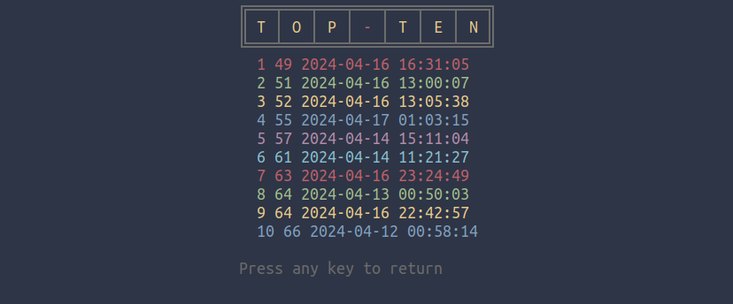
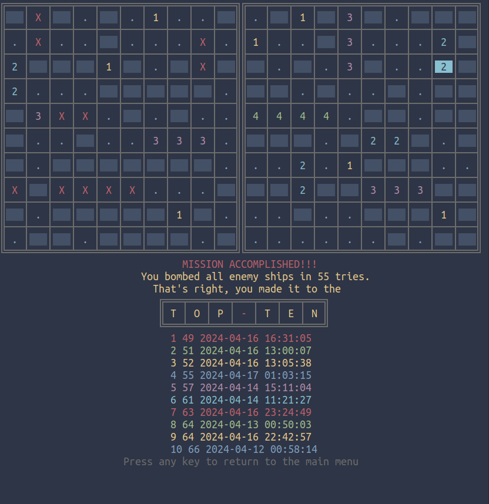

# tui-battleship

This is a tui implementation of the popular **classic naval battle game**, written in Bash.

{width=400}

The objective of the game is to **destroy the computer's fleet**,
before the computer achieves the same against you.


You can configure the positioning of your ships to be either
**automatic** or **manual**, through selecting the `e option` in the main menu.

In this variation of the game,
**it is not allowed for the player's ships to be adjacent to each other.**

You can also configure:

- the **number of each sort of ship** in the grid,

- the **navigation keys**,

- the **hit key** (`spacebar` and `enter` are also hardcoded),

- the **preferred image** to show in the notifications,

- whether **notifications** are shown,

- whether the **keybinding cheatsheet** is shown,

- whether the **game log** is shown,

- the **preferred text editor** to use within the game. 

More details on the original game and its other variations in [this wikipedia page](https://en.wikipedia.org/wiki/Battleship_(game)).


---

## Usage

{width=300}


Opening the game, the user  through the main menu, can:

- Start a new game (`n`,`N`)

{width=400}

- Configure the parameters of the game according to taste (`e`,`E`)

{width=300}

- Check out statistics (`s`,`S`)

{width=300}

- Check out Game Rules (`r`,`R`)

{width=300}

 - Just exit the game (`q`,`Q`)

---
##Play

You take turns with the computer, hitting squares in each other's grids.

You have to guess the position of the enemy ships on the
computer's 10x10 grid, in order to win.

{width=400}

You lose if the computer achieves sinking your ships first.

{width=400}

You can move on the enemy grid using the `hjkl` or the `arrow keys`.

You can hit the square you moved in using the `f`,`space` or `enter` keys.


---


While playing the user can:

- Toggle the appearence of the **keybinding cheatsheet**(`i,I`) and / or **game log** (`u,U`)

 {width=400}

- **Restart** (`r,R`) or **Quit** (`q,Q`) the current puzzle by quitting and returning to the main menu (`q,Q`)

 {width=150}


---
## Placing the vessels in the grid

A mentioned above, the user's vessels are by default placed automatically in the user's grid.

**However**, if you wish so, the game can be configured so that **you yourself can place the ships manually**  in the grid.

{width=300}

You can move to the square that you like to be the **first from the top/left** of the vessel,and hit the `Place` keybinding:

 {width=500}

From the info in the prompt, you enter the option that you want, placing the **ship that you select**, with the **orientation that you want**. 

For example,if you hit:

- `4`:horizontal position of a battleship


- `shift`+`4`:vertical  position of a battleship


{width=310}
{width=300}

The game will start automatically once you place all your vessels.

**CAUTION:** If the placement is **not possible**, you will get a message telling you so.

A placement is **not possible** when:

1. two ships are **colliding** (*the one on top of each other, or crossing*).


1. two ships are **adjacent** (*touching*).

1. a ship is placed partly **outside the grid limits**.

During this procedure, you have the option to restart (`r`,`R`), or if just you got bored, opt for  automatically ppopulate the grid with your ships (`p`,`P`).

Also, you can return to the main menu (`q`,`Q`).


---
## Configuring

As mentioned above, the games parameters can be configured within the game from the `main menu`, or by editing the `$HOME/.config/tui-battleship/tui-battleship.config` file.

|n|Variable|Explanation| Acceptable Values|Default Value|
|---|---|---|---|---|
|1| PLACE_SHIPS |Procedure to populate user's grid with ships.|auto, manual|auto|
|2|CARRIERS|Number of Carriers (4 squares long, shown 4444)|min 1, max 2|1|
|3|BATTLESHIPS|Number of BAttleships (3 squares long, shown 333)|min 1, max 3|2|
|4|CRUISERS|Number of Cruisers (2 squares long, shown 22)|min 1, max 4|3|
|5|DESTROYERS|Number of Destroyers (1 square long, shown as 1)|min 1, max 5|4|
|6|PREFERRED_EDITOR |Editor to be used to open the config file|Any gui or tui text editor|`$EDITOR`\|\|`nano`|
|7|PREFERRED_PNG |Preferred themed png to show up in the notifications.|light, dark|dark|
|8|NOTIFICATION_TOGGLE|Show Notifications while playing|yes / no| yes|
|9|LOG_TOGGLE|Show Game Log while playing (can be also toggled while playing)|yes / no| yes|
|10|CHEATSHEET_TOGGLE|Show keybinding cheatsheet  (can be also toggled while playing)|yes / no| yes|
|11|HIT_BIND|Key binding to hit a square|**CAUTION**: NON-ACCEPTABLE VALUES:upper-case A,B,C,D, lower and upper-case navigation keys,lower and upper-case E,R,I,U,P,Q.**Also spacebar and enter are hardcoded**|f|
|12|NAVIGATION_KEYS|Keys to navigate in the grid. Arrow keys are also hardcoded and work in all options.| vim (hjkl), aswd |vim|


- If the configuration file is not properly loaded, the game will begin with hardcoded default values.

- Available logo pngs (copied in `~/.local/share/tui-battleship/` directory):


 {width=150}

---

## Install

- Clone to repository, and move to the `tui-battleship` directory:

```
git clone https://gitlab.com/christosangel/tui-battleship.git&&cd tui-battleship/
```
- Make `install.sh` executable, then run it

```
chmod +x install.sh&&./install.sh
```
You are good to go. 

---
##Run

The script has been copied to `~/.local/bin/`, if this directory is in the system's `$PATH`, You can run it with

```
tui-battleship.sh
```
otherwise, from the `tui-battleship/` directory:

```
./tui-battleship.sh
```

---

**Enjoy!**


